# AOD-GAN
AOD-GAN is based on **AOD-Net**:[An All-in-One Network for Dehazing and Beyond](https://arxiv.org/abs/1707.06543).
AOD-Net is a lightly model application to image dehaze.we extend the model and called AOD-GAN.

**Compare**

model    | Architecture |GAN Loss| MSE Loss |Perception Loss|
---------|--------------|--------|----------|---------------|
AOD-GAN  |    Only G    |   NO   |    Yes   |      NO       |
AOD-Net  |    G + D     |   Yes  |    Yes   |     Yes       |


**Environmention:**
- Python 3 
- Pytorch 0.4
- ubuntu 16.04

**Test On Image**
```
python TestImage.py --input input_image --output_image
```
**Test On Video**
```
python TestVideo.py --input input_video.mp4
```
**Results**
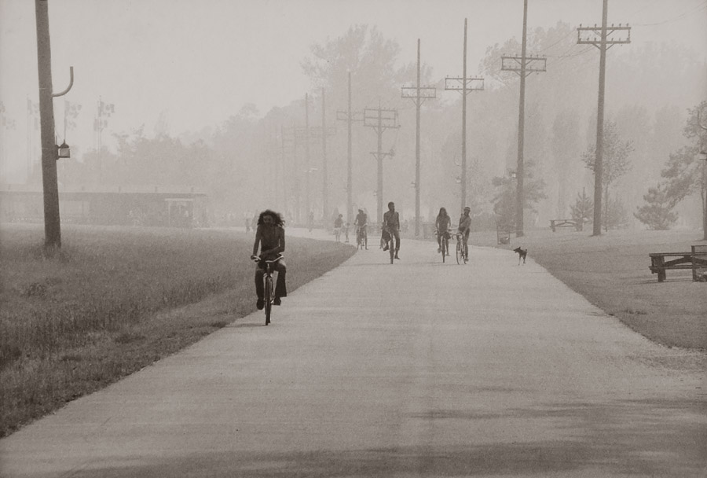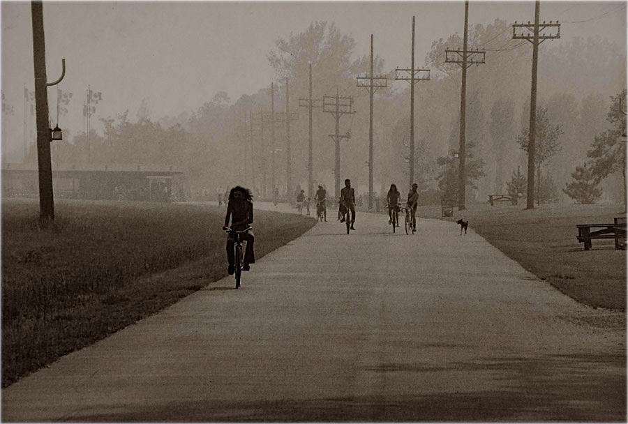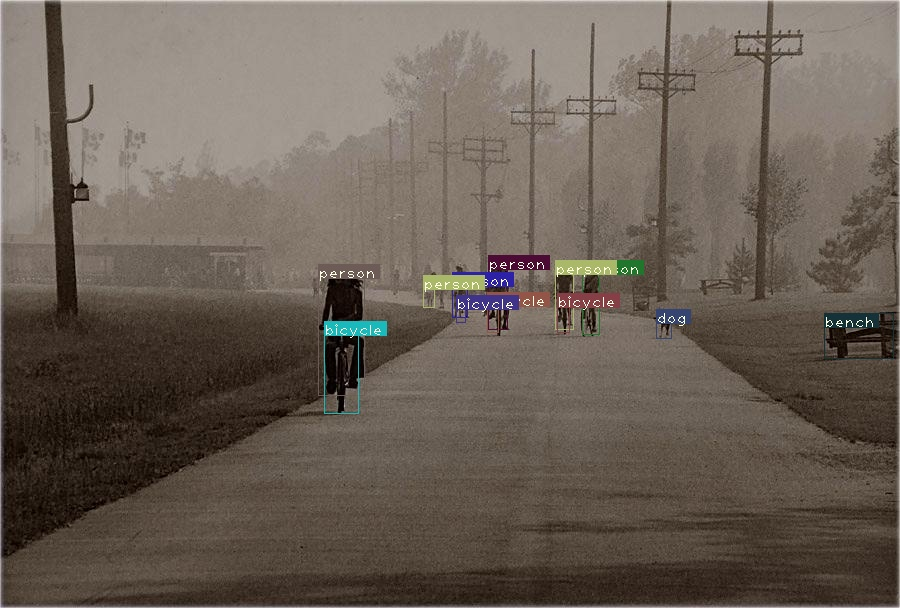
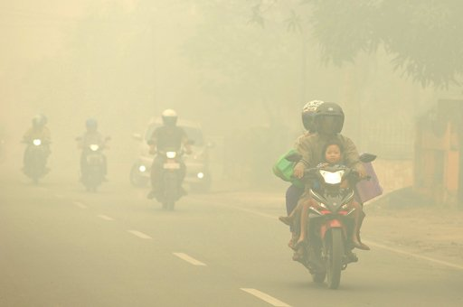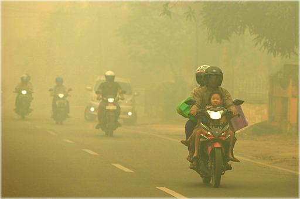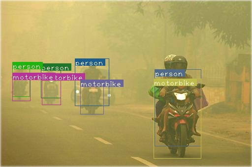
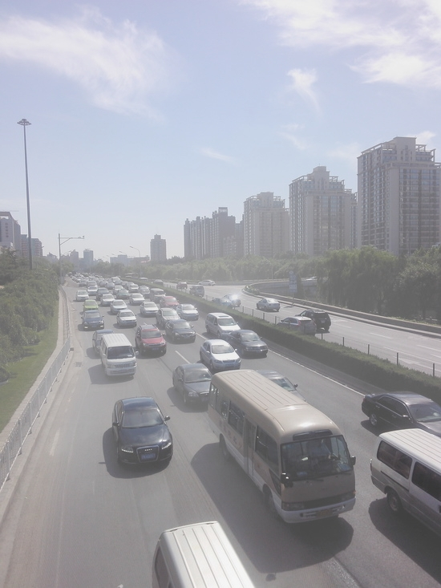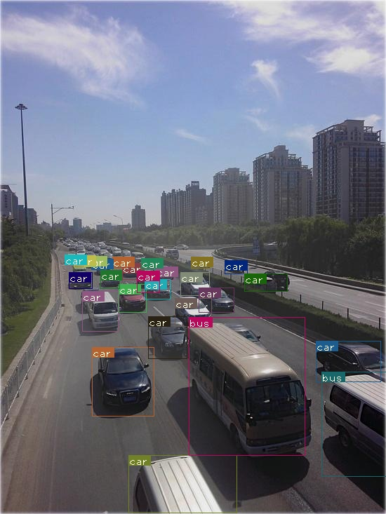
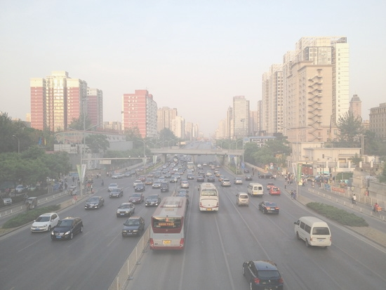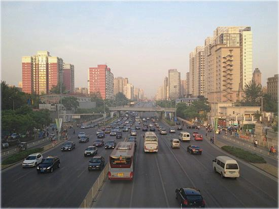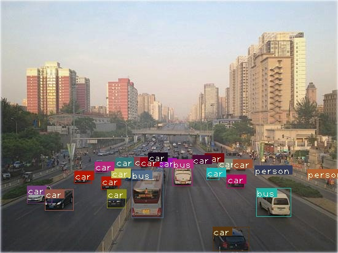
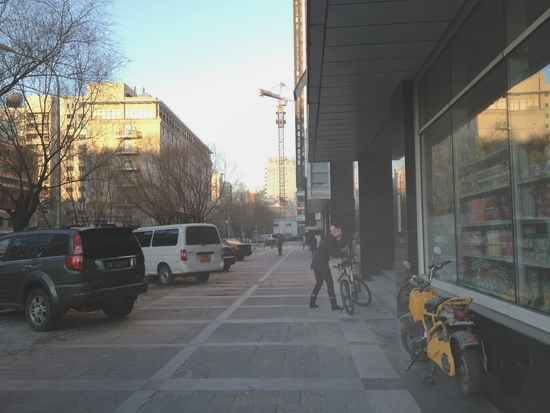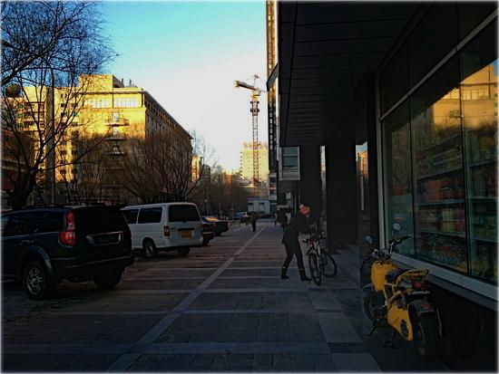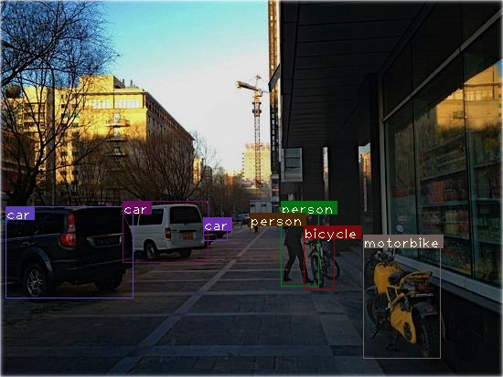

**References**
- [An All-in-One Network for Dehazing and Beyond](https://arxiv.org/abs/1707.06543).
  Boyi Li, Xiulian Peng, Zhangyang Wang, Jizheng Xu, Dan Feng.
- [Generative Adversarial Networks](https://arxiv.org/abs/1406.2661).
  Ian J. Goodfellow, Jean Pouget-Abadie, Mehdi Mirza, Bing Xu, David Warde-Farley, 
  Sherjil Ozair, Aaron Courville, Yoshua Bengio.
- [YOLOv3:An Incremental Improvement](https://pjreddie.com/media/files/papers/YOLOv3.pdf).
  Joseph Redmon, Ali Farhadi.
